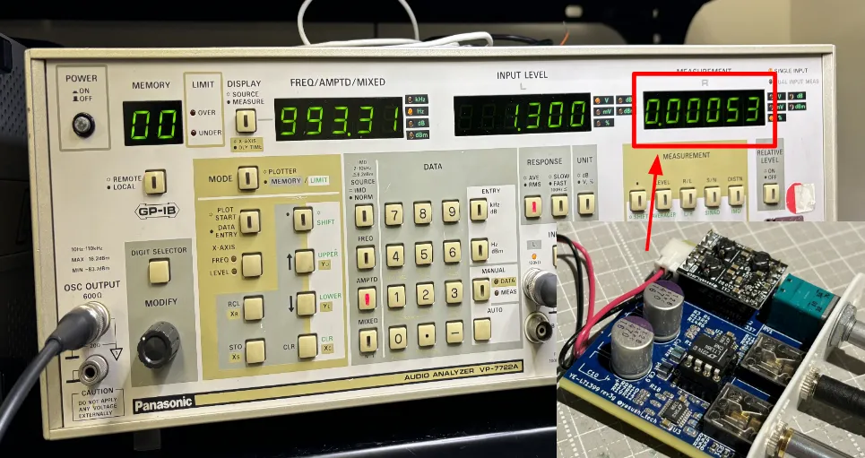

## 概要
ヘッドホンアンプ「YA-LT1399」は電流帰還高速アンプIC、「LT1399」を
L/Rch3回路分ずつ用いた高性能ハイパワーなアンプです。  

## 計測・性能

THD+N: 0.00053%

## yasushiの担当
(単独開発のプロダクトです)

## 技術スタック
- 電流帰還
- オペアンプ
- アナログ

## リンク
[頒布先リンク](https://yasushitech.booth.pm/items/5915503)
