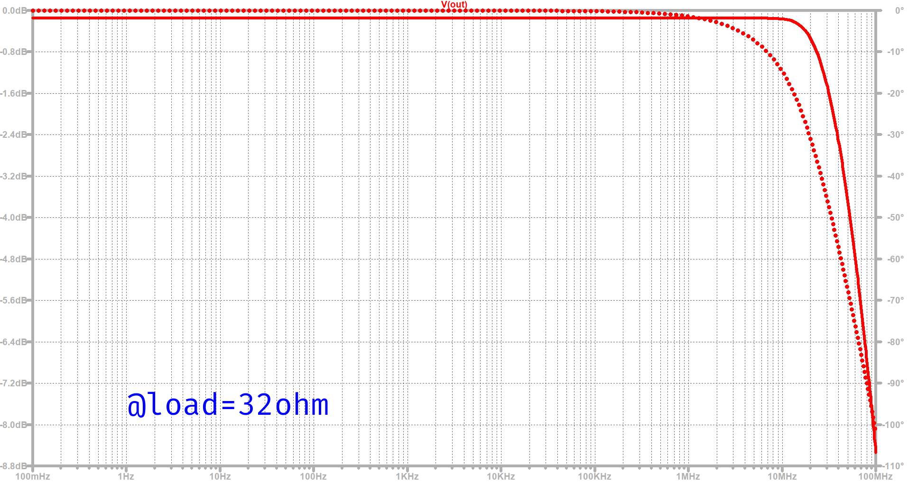
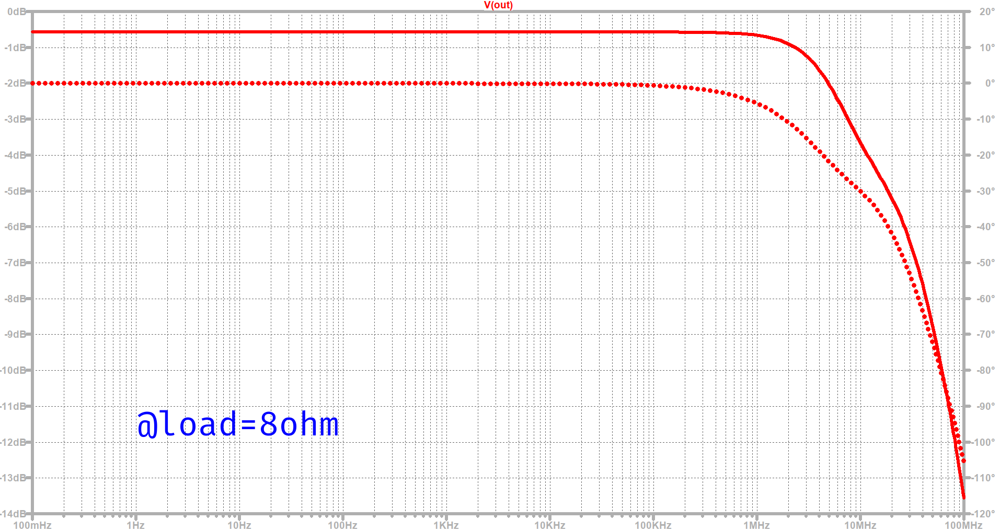
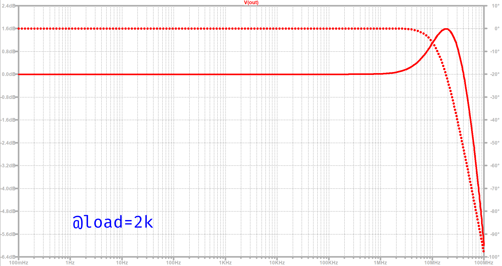
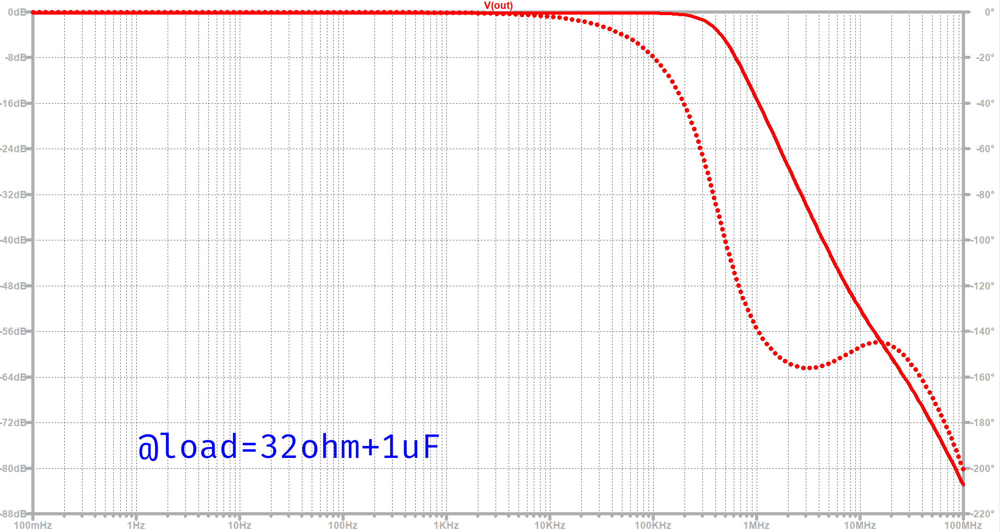

## 概要
ヘッドホンアンプ「YA-OPA2675」は電流帰還オペアンプ、「OPA2675」を用い、
低インピーダンス負荷時にも優れた位相特性を維持する広帯域アンプです。  

## 計測・性能
<!-- frequency-response.webp : 32ohm -->
<!--   -->

### 32 Ω負荷

以下は、負荷を変動させた際の応答です。

### 8 Ω負荷

### 2 kΩ負荷

### 32 Ω + 1 µF負荷

## yasushiの担当
(単独開発のプロダクトです)

## 技術スタック
- 電流帰還
- オペアンプ
- アナログ

<!-- ## リンク
[頒布先リンク](https://yasushitech.booth.pm/items/5915503) -->
