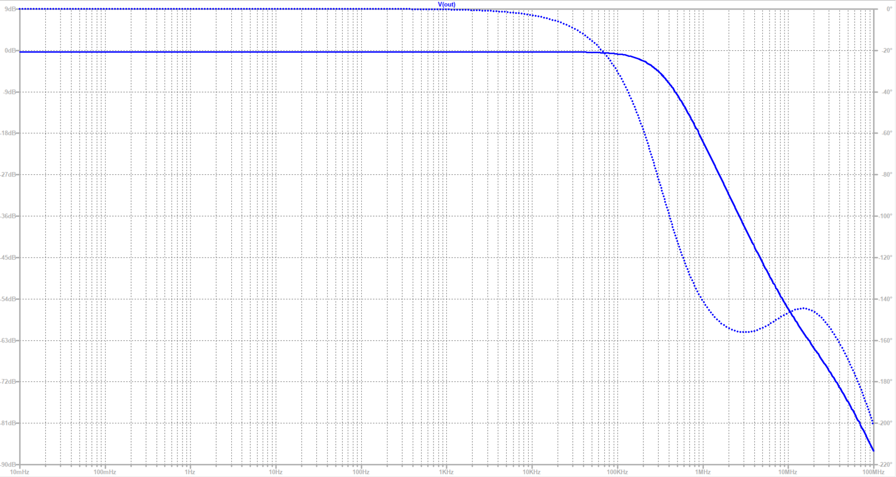

## 概要
ヘッドホンアンプ「YA-OPA2675」は電流帰還オペアンプ、「OPA2675」を用い、
低インピーダンス負荷時にも優れた位相特性を維持する広帯域アンプです。  

## 計測・性能

## yasushiの担当
(単独開発のプロダクトです)

## 技術スタック
- 電流帰還
- オペアンプ
- アナログ

<!-- ## リンク
[頒布先リンク](https://yasushitech.booth.pm/items/5915503) -->
