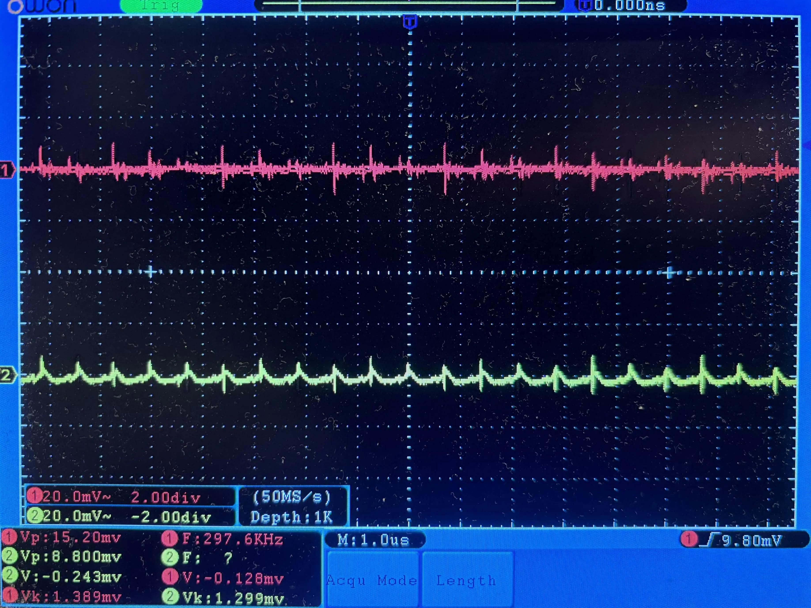

## 概要
センサ/アナログ評価の再現性を上げる目的で、低ノイズ電源を設計・基板化しました。

## 性能

$
V_{\mathit{pp}}^{+{out}} = 15.2\ \mathrm{mV_{pp}}
$

$
V_{\mathit{pp}}^{-{out}} = 8.8\ \mathrm{mV_{pp}}
$

$
V_{\mathit{rms}}^{+{out}} = 1.389\ \mathrm{mV_{rms}}
$

$
V_{\mathit{rms}}^{-{out}} = 1.229\ \mathrm{mV_{rms}}
$

特記なき場合の計測条件:  
- Vin = 3.7v
- Vout = +-12v
- R(load): 各100Ω
- オシロスコープ: owon SDS7202

## yasushiの担当
(単独開発のプロダクトです)

## 技術スタック
- 回路設計

## リンク
https://twitter.com/yasushi_tech/status/1930248073403580618